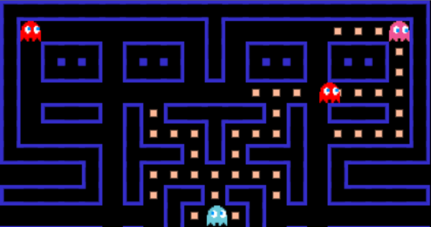
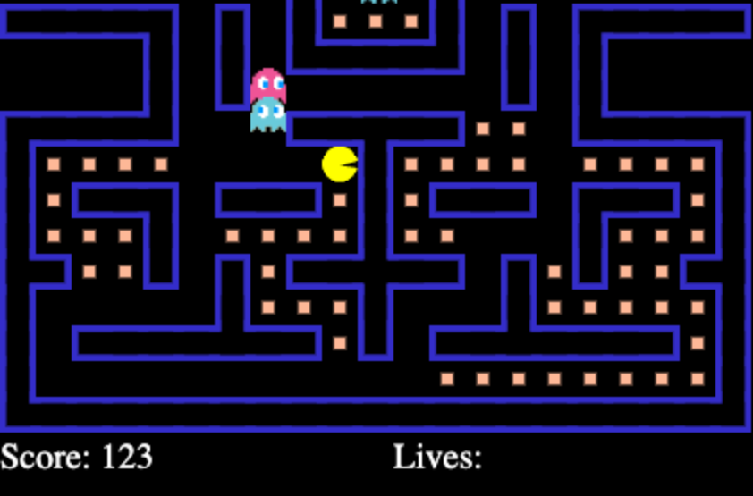

# Pacman Game developed by JavaScript

## Description

Welcome to the world of Pacman! This is a classic arcade game that has been enjoyed by generations of gamers since its introduction in 1980. <br />
I develop own pacman, so everyone can change color, texture and speed of objects.

---

## Features

With this code, all ghosts have a red circle from which you can see their angle of view. <br />
(file: ghost.js , method: draw())

```javascript
 canvasContext.strokeStyle = "red";
         canvasContext.arc(
             this.x + oneBlockSize / 2,
             this.y + oneBlockSize / 2,
             this.range * oneBlockSize,
             0,
             2 * Math.PI
         );
```

---


---

## Screenshots

Screenshots from game. <br />




---

## Thanks

Thanks for : @ServetGulnaroglu <br />
Hope you enjoy!
